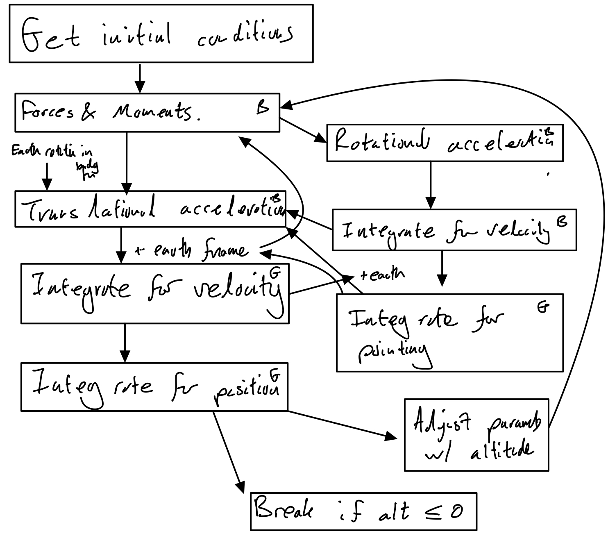
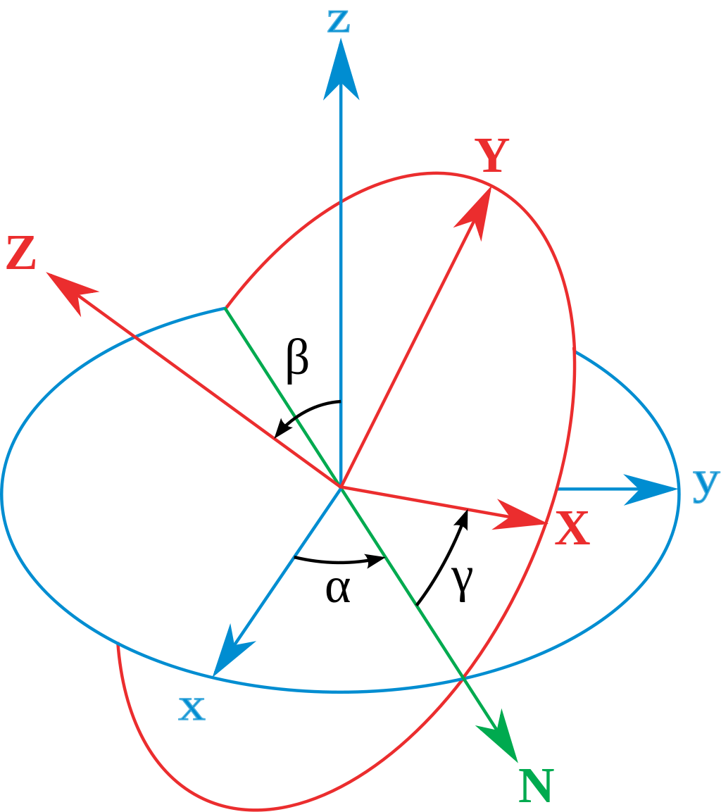

# 6 DOF Rocket Simulation - CUSF
## Main literature
### Paper A: [NASA Basic Considerations for Rocket Trajectory Simulation](https://apps.dtic.mil/sti/pdfs/AD0642855.pdf)
Fully defined forces for thrust and aero forces with good explanation. Sets out the core of what we need to achieve.
### Paper B: [STOCHASTIC FLIGHT SIMULATION APPLIED TO A SOUNDING ROCKET](https://sci-hub.do/10.2514/6.iac-04-a.1.07)
Can inform later on to include statistical simulation. Also includes parachute forces.
### Paper C: [Trajectory Prediction for a Typical Fin Stabilized Artillery Rocket](https://journals.ekb.eg/article_23742_f19c1da1a61e78c1f5bb7ce58a7b30dd.pdf)
Covers the same ground as Paper A. Has a flow chart that we could consult if we get stuck. Possibly clearer defintions of some things. Also gives parameters for a vehicle we could use to verify. Includes wind forces.
### Paper D: [Six degree-of-freedom (6-DOF) Flight Simulation Check-cases](https://nescacademy.nasa.gov/flightsim/)
Provides check cases and peformace comparison and some lessons learned (but seem to complex for our needs anyway).
### Paper E: [DAVE-ML](https://daveml.org/intro.html)
DAVE-ML is a standard for data handeling in simulation software that we should probably try to adhere to, might be a pain though since they use XML instead of something designed in the last centuary.
### Paper F: [SIX DEGREE OF FREEDOM DIGITAL SIMULATION MODEL FOR UNGUIDED FIN-STABILIZED ROCKETS](https://apps.dtic.mil/dtic/tr/fulltext/u2/452106.pdf)

### Paper G: [Stochastic Six-Degree-of-Freedom Flight Simulator for Passively Controlled High-Power Rockets](https://ascelibrary.org/doi/10.1061/%28ASCE%29AS.1943-5525.0000051)
(Has Hugh Hunt as an author)

### [Numerical Recipies](https://cloudflare-ipfs.com/ipfs/bafykbzacebqr3dr5pl3o23plmtxhafrin65b2ysk6b4ettofftex5n5gp5efm?filename=William%20H.%20Press%2C%20Saul%20A.%20Teukolsky%2C%20William%20T.%20Vetterling%2C%20Brian%20P.%20Flannery%20-%20Numerical%20recipes_%20the%20art%20of%20scientific%20computing-Cambridge%20University%20Press%20%282007%29.pdf)
Used for integration algorithm

We need to make sure to remove all the links to pirated books if we make the repository public. 

## Additional papers

#### Dynamics:

https://arxiv.org/pdf/1604.08139.pdf - Ways to integrate angular velocity to get an orientation - includes using quaternions

https://www.tu-berlin.de/fileadmin/fg169/miscellaneous/Quaternions.pdf - Introduction into quaternions for spacecraft attitude
representation

#### Numerical methods:

https://dl.acm.org/doi/abs/10.1145/2742854.2742894 about improving numerical integration accuracy (probably won't be the largest error - I'd guess the error on the vehicle parameters will be bigger)

#### Modelling varying moments of inertia:

https://space.stackexchange.com/questions/41931/moment-of-inertia-of-rocket - For modelling how the moments of inertia change as the rocket consumes fuel 

https://aip.scitation.org/doi/pdf/10.1063/1.1722736

https://core.ac.uk/download/pdf/82326535.pdf - This paper says that liquids don't contribute to the roll moment of inertia I think

#### Slosh modelling :

https://ntrs.nasa.gov/citations/19670006555 - Chapter 6

#### Aerodynamics
https://arc.aiaa.org/doi/pdf/10.2514/3.62081 - Aerodynamic heating

https://ntrs.nasa.gov/citations/19730063810 - Implementation of aerodynamic heating in FORTRAN

https://pdfs.semanticscholar.org/ace3/5a61803390b0e0b70f6ca34492ad20a03e03.pdf - Coupling a 6DOF simulation with CFD

https://www.precice.org/ - Precise Code Interaction Coupling Environment - Can be used to couple Python to ANSYS Fluent

http://ohllab.org/CFD_course/index.html - PyCFD

#### Stats
https://www.umass.edu/remp/Papers/Smith&Wells_NERA06.pdf - How many samples
https://apps.dtic.mil/dtic/tr/fulltext/u2/a621501.pdf - " " "
https://ascelibrary.org/doi/pdf/10.1061/%28ASCE%29AS.1943-5525.0000051 - Basically what we're aiming for 
- we should add random altitude parachute failures
- can we add the ability to cant the fins and simulate roll stabalisation
- Atmo needs to be way more complicated

## Program Workflow

## Notes on design choices
### Integration method
RK4 chosen with the aid of [this](https://www.sciencedirect.com/science/article/pii/0045794981900675) paper.

## Variables that can vary
- Rail pointing
- Aero coefficients
- Engine parameters
- Gravitational force
- Dry mass
- Wet mass
- Moment of inertia
- Thrust miss alignment
- Air density, temperature and pressure

